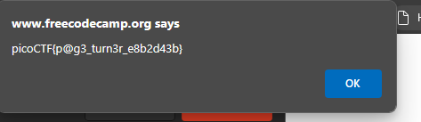
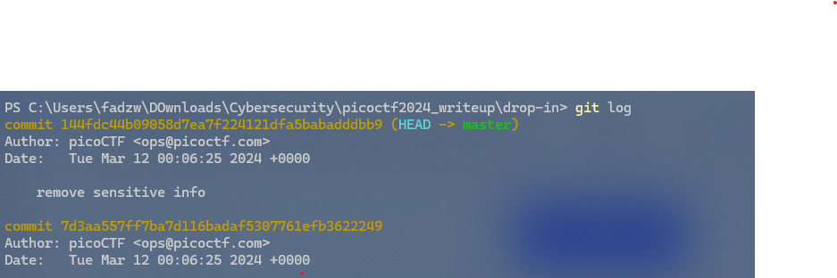
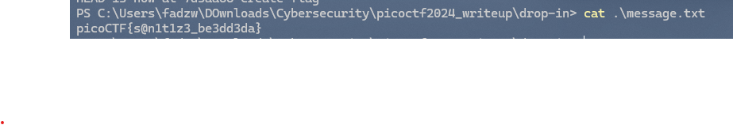

## 1. Super ssh

enter this command and enter the password when prompted

<code>ssh <username>@titan.ctf.net -p 54184 </code>

## 2. Bookmarklet

bookmarklet are javascript bookmark. bookmarklet are available in all major browser.

to add bookrmarklet write javascript in the url field of the bookmark modal

after adding the bookmark click the bookmark. [read more](https://www.freecodecamp.org/news/what-are-bookmarklets/)

## 3. Commitment Issues

after unzip the file , try list hidden files <code>.git</code>. you'll notice there is message.txt that might look important.

to solve this , learn few things about [git](https://primer.picoctf.org/#_git_version_control).

first we need to loo into check out the commit, somehow the previos commit contain the flag and got removed.

we need to checkout the previous commit

and cat the message

## 4. interencdec

just decode cipher in base64 two times and rot13 with 19 rotation <code>YidkM0JxZGtwQlRYdHFhR3g2YUhsZmF6TnFlVGwzWVROclgyZzBOMm8yYXpZNWZRPT0nCg==</code>

## 5. Time Machine
download the challenge.zip, navigate to drop-in , cat the message and read the clue , enter <code>git log</code> to look into commit history